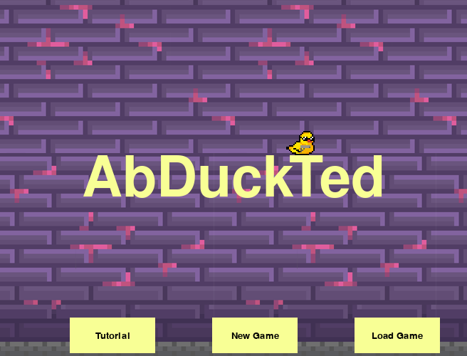
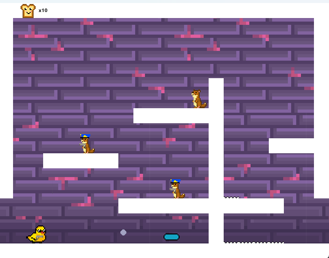
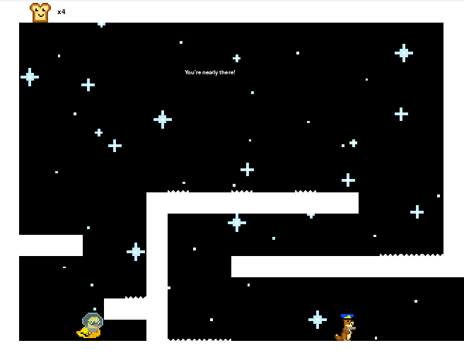
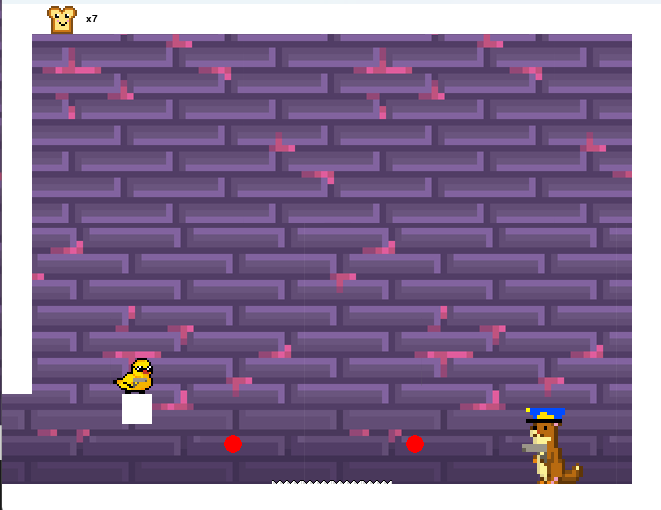

# Abduckted



It is a 2D platformer that I made using Python's Pygame. 

It shows the journey of a duck called Ted who gets abducted and needs to fight his way back home... 





# Requirements to play

Requirements to run this game:
- pygame 2.6.1
- python 3.11.15

Then run command:
```bash
python Abduckted.py
```


# Background

This is a game I made in 2019 for a school project. I have recently revisited it in hopes to revamp it. I would like to change the music and gameplay a bit so that it is more fun to play. 

The goal is to hopefully upload it to itch.io or some other platform.